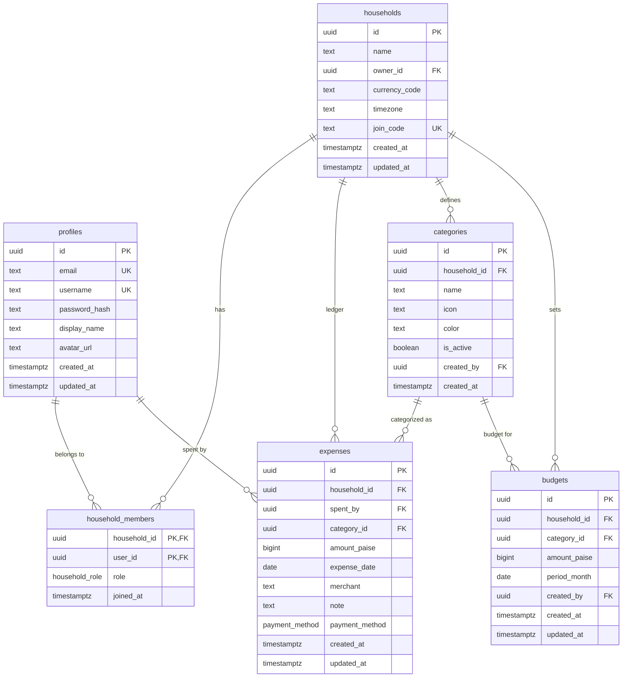

<p align="center">
  
</p>

<h1 align="center">FamilyLedger</h1>

<p align="center">
  <strong>One shared household expense ledger for the whole family.</strong>
</p>

<p align="center">
  <a href="#-features">Features</a> ·
  <a href="#-android-app">Android App</a> ·
  <a href="#%EF%B8%8F-tech-stack">Tech Stack</a> ·
  <a href="#-getting-started">Getting Started</a> ·
  <a href="#-project-structure">Structure</a> ·
  <a href="#-database-schema">Schema</a> ·
  <a href="#-deployment">Deployment</a> ·
  <a href="#-contributing">Contributing</a> ·
  <a href="#-license">License</a>
</p>

<p align="center">
  
  
  
  
  
</p>

---

## 📸 Overview

FamilyLedger is a **shared household expense tracker** designed for Indian families. Every family member logs their spending into one common ledger—no more spreadsheets, no more WhatsApp screenshots. Built with a premium dark-mode UI, real-time analytics, and a custom session-based auth system that runs entirely inside PostgreSQL.

> **Currency:** INR (₹) · **Amounts stored as:** integer paise (never floating point)

---

## ✨ Features

| Area | What you get |
|---|---|
| **Dashboard** | Monthly KPI cards, daily spend trend chart, category breakdown, budget pulse, member spend split, and latest activity feed |
| **Transactions** | Full CRUD for expenses with category, merchant, notes, payment method (UPI / Cash / Card / Bank Transfer), filters, and CSV export |
| **Analytics** | Month-over-month comparison, category donut chart, member bar chart, cumulative spend curve, daily average, and projected month-end spend |
| **Budgets** | Household-wide monthly budget + per-category budgets with progress bars and overspend alerts |
| **Members** | Invite family members via 6-character join code, role management (Owner / Member), member profiles |
| **Settings** | Household settings, category management (create / edit / deactivate), owner-only household deletion with type-to-confirm, account preferences |
| **Auth** | Fully custom auth—sign up, login, and sessions handled by PostgreSQL RPCs with bcrypt hashing and rate-limited login attempts |
| **Security** | Row Level Security on every table, composite FK constraints ensuring spender ∈ household, SECURITY DEFINER RPCs for sensitive operations |

---

## 📱 Android App

`mobile-app/` is a Kotlin WebView shell that ships FamilyLedger as an Android
app. The React app does the work; the shell owns the launcher icon, the splash
screen, edge-to-edge insets, pull-to-refresh, offline recovery, and the
file-save bridge the CSV export needs.

| | |
|---|---|
| **Min / target SDK** | 24 / 37 |
| **Build** | `cd mobile-app && .\gradlew.bat :app:assembleDebug` |
| **Refresh on open** | Reloads the current route on every return to the foreground, unless a modal is open (so an in-progress expense is never lost) |
| **Deep links** | `…/onboarding?join=CODE` opens the app once App Links are verified |

The palette in `mobile-app/app/src/main/res/values/colors.xml` mirrors
`tailwind.config.js` token for token — the two are deliberate duplicates, so
update both together.

See [`mobile-app/README.md`](mobile-app/README.md) for signing, Play Store
set-up, App Links verification and icon regeneration.

---

## 🛠️ Tech Stack

### Frontend

| Technology | Purpose |
|---|---|
| [React 18](https://react.dev) | UI library |
| [TypeScript 5.6](https://www.typescriptlang.org) | Type safety |
| [Vite 5](https://vitejs.dev) | Build tool & dev server |
| [TanStack Query v5](https://tanstack.com/query) | Server state management & caching |
| [React Router v6](https://reactrouter.com) | Client-side routing |
| [React Hook Form](https://react-hook-form.com) + [Zod](https://zod.dev) | Form handling & schema validation |
| [Recharts](https://recharts.org) | Charts & data visualization |
| [Radix UI](https://www.radix-ui.com) | Accessible headless UI primitives |
| [Tailwind CSS 3](https://tailwindcss.com) | Utility-first styling |
| [Lucide React](https://lucide.dev) | Icon library |

### Backend & Infrastructure

| Technology | Purpose |
|---|---|
| [Supabase](https://supabase.com) (PostgreSQL + PostgREST) | Database, API, and auth RPCs |
| [pgcrypto](https://www.postgresql.org/docs/current/pgcrypto.html) | bcrypt password hashing & CSPRNG tokens |
| [Vercel](https://vercel.com) | Hosting & CDN |

### Testing & Quality

| Technology | Purpose |
|---|---|
| [Vitest](https://vitest.dev) | Unit & integration testing |
| [Testing Library](https://testing-library.com) | Component testing utilities |
| [ESLint](https://eslint.org) | Code linting |

---

## 🚀 Getting Started

### Prerequisites

- **Node.js** ≥ 18
- **npm** ≥ 9
- A [Supabase](https://supabase.com) project (free tier works fine)

### 1. Clone the repository

```bash
git clone https://github.com/RARPlayzDev/FamilyLedger.git
cd FamilyLedger
```

### 2. Install dependencies

```bash
npm install
```

### 3. Configure environment variables

```bash
cp .env.example .env.local
```

Fill in your Supabase credentials:

| Variable | Description |
|---|---|
| `VITE_SUPABASE_URL` | Your Supabase project URL (e.g. `https://abc.supabase.co`) |
| `VITE_SUPABASE_ANON_KEY` | Public anon / publishable key |

> ⚠️ **Never** put service-role keys or database passwords in `VITE_` variables—they are embedded in the client bundle.

### 4. Apply database migrations

Run the migrations in order against your Supabase project using the [Supabase CLI](https://supabase.com/docs/guides/cli) or the SQL editor in the dashboard:

```
supabase/migrations/
├── 20260101000000_core_schema.sql          # Tables, enums, triggers
├── 20260101000050_custom_auth.sql          # Custom auth RPCs & sessions
├── 20260101000100_rls_and_integrity.sql    # RLS policies & membership guards
├── 20260101000200_analytics_functions.sql  # Server-side aggregate functions
├── 20260101000200_write_rpcs.sql           # Every mutation (SECURITY DEFINER RPCs)
├── 20260101000300_seed_system_categories.sql # Default expense categories
└── 20260101000400_household_teardown.sql   # Owner-only household deletion
```

Or with the Supabase CLI:

```bash
supabase db push
```

### 5. Start the dev server

```bash
npm run dev
```

The app will be available at **http://localhost:5173**.

---

## 📁 Project Structure

```
FamilyLedger/
├── public/                     # Static assets (favicon, etc.)
├── src/
│   ├── components/
│   │   ├── auth/               # Route guards (RequireSession, RequireHousehold)
│   │   ├── charts/             # Recharts wrappers (Daily, Category, Member, Donut)
│   │   ├── layout/             # AppShell, navigation
│   │   ├── shared/             # Reusable components (MonthPicker, Money, CategoryIcon)
│   │   ├── system/             # ErrorBoundary, ConfigurationNotice
│   │   └── ui/                 # Design system primitives (20+ components)
│   ├── domain/                 # Pure business logic (zero side effects)
│   │   ├── analytics.ts        # Aggregation, comparisons, projections
│   │   ├── budgets.ts          # Budget calculations & thresholds
│   │   ├── csv.ts              # CSV export builder
│   │   ├── dates.ts            # Timezone-aware date utilities
│   │   ├── expenses.ts         # Expense filtering & sorting
│   │   └── money.ts            # INR formatting (₹), paise ↔ rupees
│   ├── features/
│   │   ├── dashboard/          # KpiRow, BudgetPulseCard, MemberSpendCard
│   │   └── expenses/           # ExpenseForm, ExpenseTable, filters, schema
│   ├── hooks/                  # React hooks for data fetching & state
│   │   ├── use-session.tsx     # Auth session context
│   │   ├── use-household.tsx   # Active household context
│   │   ├── use-expenses.ts     # Expense CRUD queries
│   │   ├── use-analytics.ts    # Analytics queries
│   │   ├── use-budgets.ts      # Budget queries
│   │   ├── use-categories.ts   # Category queries
│   │   └── use-members.ts      # Member queries
│   ├── lib/                    # Infrastructure utilities
│   │   ├── supabase.ts         # Supabase client singleton
│   │   ├── query-client.ts     # TanStack Query configuration
│   │   ├── env.ts              # Environment variable validation
│   │   └── errors.ts           # Error handling & user-friendly messages
│   ├── routes/                 # Page components (one per route)
│   │   ├── AuthPage.tsx        # Sign up / Login
│   │   ├── OnboardingPage.tsx  # Create or join a household
│   │   ├── DashboardPage.tsx   # Main dashboard
│   │   ├── TransactionsPage.tsx
│   │   ├── AnalyticsPage.tsx
│   │   ├── BudgetsPage.tsx
│   │   ├── MembersPage.tsx
│   │   └── SettingsPage.tsx
│   ├── services/               # Supabase API calls (data access layer)
│   ├── tests/                  # Test suites
│   └── types/                  # TypeScript type definitions
│       ├── database.ts         # Supabase-generated DB types
│       └── domain.ts           # Application domain types
├── mobile-app/                 # Android WebView shell (Kotlin)
│   ├── app/src/main/           #   Manifest, MainActivity, resources
│   ├── store/                  #   Play listing icon, assetlinks template
│   └── tools/                  #   Icon generator, fingerprint helper
├── supabase/
│   ├── config.toml             # Supabase CLI configuration
│   └── migrations/             # Ordered SQL migration files
├── vercel.json                 # Vercel deployment config
├── tailwind.config.js          # Custom dark theme & design tokens
├── vite.config.ts              # Vite configuration
└── package.json
```

---

## 🗄️ Database Schema



### Key Design Decisions

- **Integer paise** — All monetary values are stored as `BIGINT` paise (1/100 ₹). No floating-point rounding errors, ever.
- **Composite FK constraint** — `expenses(household_id, spent_by)` references `household_members(household_id, user_id)`, making it impossible at the storage layer for a member to log an expense against a different household.
- **Custom auth** — No Supabase Auth dependency. Password hashes (bcrypt via pgcrypto) never leave the database. Sessions use SHA-256 hashed tokens. Login attempts are rate-limited (10 failures → 15-minute lockout).
- **System categories** — Categories with `household_id IS NULL` are system defaults shared across all households.
- **Multi-household ready** — Every table carries a `household_id` FK; onboarding a second family requires zero schema changes.
- **Household lifecycle** — Leaving is a plain membership delete, so `guard_household_member` refuses to drop the owner's row and ownership must be transferred first. Deleting the household is the owner-only `delete_household` RPC: it removes child rows in foreign-key order and whitelists that single owner-membership delete through a transaction-local flag, so the leave rule still holds everywhere else. Accounts are never deleted — only their membership is.
- **Sessions** — `public.sessions` stores one row per sign-in: `token_hash` (SHA-256 of the bearer token, the primary key), `user_id` (FK to `profiles`, `ON DELETE CASCADE`) and `created_at`. The raw token exists only in the browser's localStorage and travels as the `x-familyledger-session` header, which `session_user_id()` resolves inside every policy and RPC. Rows never expire; `logout()` is what removes them. RLS is on with zero policies and all grants revoked, so no client role can read or write the table directly.

- **Mobile / touch UI** — One shell serves desktop and phones: a persistent
  sidebar from `lg` upwards, a fixed five-slot bottom bar below it, and dialogs
  that arrive as bottom sheets on phones. Every control is at least 44px tall on
  touch, text boxes are 16px there (below that iOS Safari zooms the page on
  focus), `env(safe-area-inset-*)` keeps content clear of the gesture bar, and
  the page is `overflow-x: clip` rather than `hidden` so `position: sticky` keeps
  working for the top bar. `interactive-widget=resizes-content` in the viewport
  meta is what lets the on-screen keyboard shrink the layout instead of covering
  the dialog footer.

---

## 🔒 Security Model

| Layer | Protection |
|---|---|
| **Authentication** | Custom PostgreSQL RPCs (`sign_up`, `login`, `resolve_session`) with bcrypt hashing and brute-force lockout |
| **Session management** | SHA-256 hashed tokens stored server-side; raw tokens exist only in the browser |
| **Row Level Security** | Every table has RLS enabled; policies use `session_user_id()` to scope all reads/writes to the caller's household |
| **SECURITY DEFINER RPCs** | Sensitive operations (auth, join codes, session resolution) run with elevated privileges in controlled functions |
| **Membership integrity** | Composite FK ensures `spent_by ∈ household_members`; no cross-household data leakage |
| **Transport** | HTTPS enforced; security headers set via Vercel (`X-Content-Type-Options`, `X-Frame-Options`, `Referrer-Policy`) |

---

## 📜 Available Scripts

| Command | Description |
|---|---|
| `npm run dev` | Start Vite dev server |
| `npm run build` | Type-check + production build |
| `npm run preview` | Preview production build locally |
| `npm run lint` | Run ESLint |
| `npm run typecheck` | Type-check without emitting |
| `npm test` | Run tests with Vitest |
| `npm run test:watch` | Run tests in watch mode |

---

## 🌐 Deployment

FamilyLedger is configured for **Vercel** out of the box.

1. **Import the repo** on [vercel.com](https://vercel.com/new)
2. **Set environment variables** in the Vercel dashboard:
   - `VITE_SUPABASE_URL`
   - `VITE_SUPABASE_ANON_KEY`
3. **Deploy** — Vercel auto-detects the Vite framework, runs `npm run build`, and serves from `dist/`

The `vercel.json` includes:
- SPA fallback rewrites for client-side routing
- Immutable caching for hashed assets (`/assets/*`)
- Security headers (nosniff, DENY framing, strict referrer)
- An exclusion for `/.well-known/`, so Android App Links verification files are
  served as themselves instead of being rewritten to `index.html`

### Android release

The Android shell is built and signed separately — see
[`mobile-app/README.md`](mobile-app/README.md). Two deployment details are easy
to miss:

- `public/.well-known/assetlinks.json` must list the fingerprint of the
  certificate the installed build is signed with, otherwise invite links open in
  the browser instead of the app. Print it with
  `mobile-app/tools/print-signing-fingerprint.ps1`.
- Nothing else is needed: the app loads the same deployed origin, so every Vercel
  deploy reaches Android users immediately with no app update.

---

## 🤝 Contributing

Contributions are welcome! Here's how to get started:

1. **Fork** the repository
2. **Create** a feature branch: `git checkout -b feature/amazing-feature`
3. **Commit** your changes: `git commit -m "feat: add amazing feature"`
4. **Push** to your branch: `git push origin feature/amazing-feature`
5. **Open** a Pull Request

### Guidelines

- Follow the existing code style (ESLint + TypeScript strict mode)
- Keep domain logic pure (no side effects in `src/domain/`)
- All monetary calculations must use integer paise
- Write tests for new domain logic
- Use [Conventional Commits](https://www.conventionalcommits.org/) for commit messages

---

## 📄 License

This project is currently unlicensed. All rights reserved by the author.

---

<p align="center">
  Built with ❤️ for families who want to spend smarter, together.
</p>
